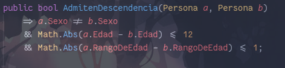
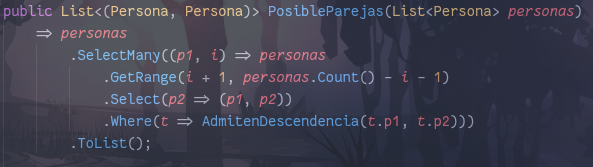
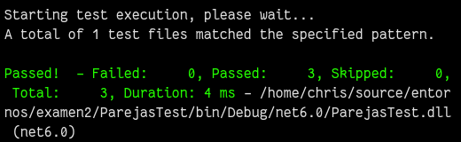
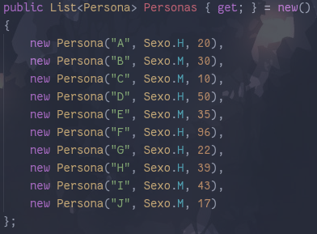
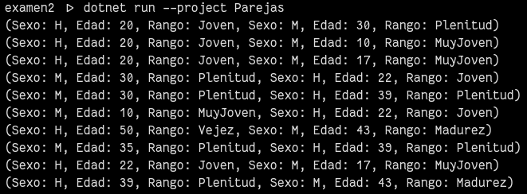

# Explicación
## Método 1
El método consiste en una única expressión que evaluará `true` únicamente si las tres condiciones dadas por el enunciado son verdaderas.

## Método 2
De forma declarativa, emparejamos todas personas con las de la sublista a continuación de cada una y filtramos las parejas  válidas.

# Demostración
## Pruebas

## Método 2
### Lista de Personas

### Salida
